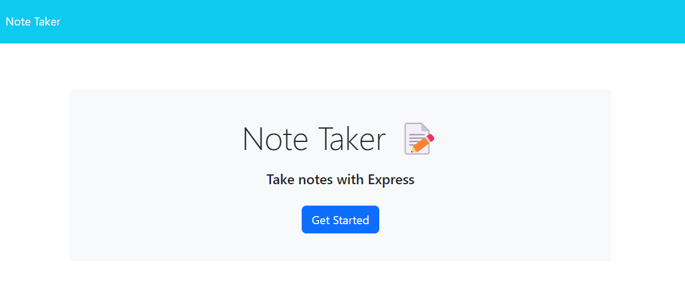
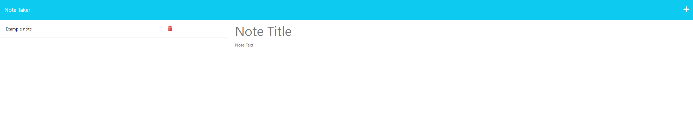
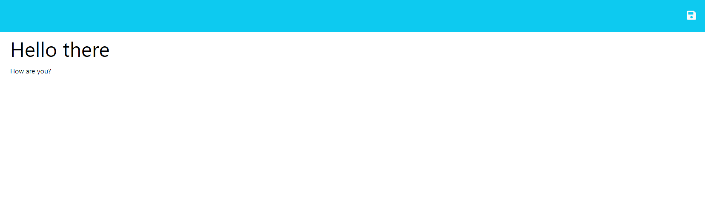
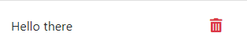

# Module 11 Challenge: Note Taker

## Table of Contents

- [Installation](#installation)
- [Description](#description)
- [Usage](#usage)
- [License](#license)

## Description

- A simple to use note-taking application that saves and deletes user-made notes.
- Built using JavaScript, with NodeJS as the Server Environment and Express.js as the Web Framework.
- Working with a web framework to fetch data from a set database has furthered my knowledge in building scalable, interactive, and responsive Web Applications.

## Installation

[Live deployment from Heroku- Access by clicking here.](https://obscure-falls-61893-7f2cf2534537.herokuapp.com/)

## Usage

- Upon entering the page you will be presented with this screen.
- Get started by clicking "Get Started"

- After clicking Get started you will be presented with this page.

- Take notes by typing in the tiles and note text section.
- Save the notes by clicking the save icon on the top right of the screen.

- Delete saved notes by clicking on the red trash bin icon.

## License

MIT License

Copyright (c) 2023 JosePerez013

Permission is hereby granted, free of charge, to any person obtaining a copy
of this software and associated documentation files (the "Software"), to deal
in the Software without restriction, including without limitation the rights
to use, copy, modify, merge, publish, distribute, sublicense, and/or sell
copies of the Software, and to permit persons to whom the Software is
furnished to do so, subject to the following conditions:

The above copyright notice and this permission notice shall be included in all
copies or substantial portions of the Software.

THE SOFTWARE IS PROVIDED "AS IS", WITHOUT WARRANTY OF ANY KIND, EXPRESS OR
IMPLIED, INCLUDING BUT NOT LIMITED TO THE WARRANTIES OF MERCHANTABILITY,
FITNESS FOR A PARTICULAR PURPOSE AND NONINFRINGEMENT. IN NO EVENT SHALL THE
AUTHORS OR COPYRIGHT HOLDERS BE LIABLE FOR ANY CLAIM, DAMAGES OR OTHER
LIABILITY, WHETHER IN AN ACTION OF CONTRACT, TORT OR OTHERWISE, ARISING FROM,
OUT OF OR IN CONNECTION WITH THE SOFTWARE OR THE USE OR OTHER DEALINGS IN THE
SOFTWARE.